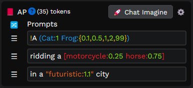

# Advanced Prompt for Easy Diffusion (Discontinued)

## Description

This tool adds an optional collapsible advanced prompt table below the prompt field, allowing you to generate and organize your prompts more efficiently, randomize modifiers, step through image settings, chat and auto prompt LLMs.

## Features

- Manage: add, edit, delete, and reorder prompts/phrases
- Commands: adjust weights, emphasis, de-emphasis, options, and blend
- Roll: Selects a random number of image modifiers. Toggle Always On (Alt + Click): sends modifiers to Chat, Auto-Pilot, and used in Cook.
- Cook: step through all combinations of samplers, inference steps, guidance scales, prompt strengths and multiple LoRAs.
- Auto-Pilot: continuously prompts LLMs and renders images
- Chat: Stream responses from remote and local LLMs with API (i.e.: OpenAI, LM Studio(CORS ENABLED))

* Commands
    - R-click handle/clear field to delete prompt from table.
    - , + enter/tab to add prompt to table.
    - Alt + : to add weight to selected phrase
    - Alt + ( to emphasis to selected phrase
    - Alt + [ to de-emphasis to selected phrase
    - Alt + Shift + { to add options to selected phrase
    - Alt + ` to add blend to selected phrase
    - Alt + Scroll to change weights, emphasis, and de-emphasis on hover

Press the "Settings" button to open the settings dialog, where you can adjust various options, such as OpenAI's API key, your name, and prime instructions. Once you've made your changes, click "Save Settings" to apply them.

If you would like chat to generate text based on your prompt, press the "Chat Imagine" button to send the prompt to the GPT-3.5-Turbo model by default. Alternatively, you can just ask chat to randomly generate anything it wants by asking it to.

## Installation

- Download raw file from src/AdvancedPrompt.plugin.js
- Place file in your plugins folder
- Refresh Easy Diffusion UI

## Support and Community

If you need help or have questions about this application, the best way to get support is by joining the Discord.

To join the Discord, click on this invite link: [Discord](https://discord.com/invite/aP9CjWE)

## Support and Donations

If you enjoy using this project and find it helpful, please consider supporting its development. Your support helps to ensure the project's continued development, bug fixes, and improvements.

### Other Ways to Support

- Share this project.
- Report any issues you encounter or suggest new features and improvements by creating a new issue on the GitHub repository.
- Contribute to the project by submitting pull requests with bug fixes, new features, or improvements to the code or documentation.
- Star the repository on GitHub to show your appreciation for the project.
- Show your support on social media. [Linktree](https://linktr.ee/3v1lxd)

### Donations

If you would like to make a financial contribution to support development, you can donate using the following method:

- [Ko-fi](https://ko-fi.com/3v1lxd)

Your donation, no matter the size, is greatly appreciated and will help to support future development and maintenance. Thank you for your generosity!
